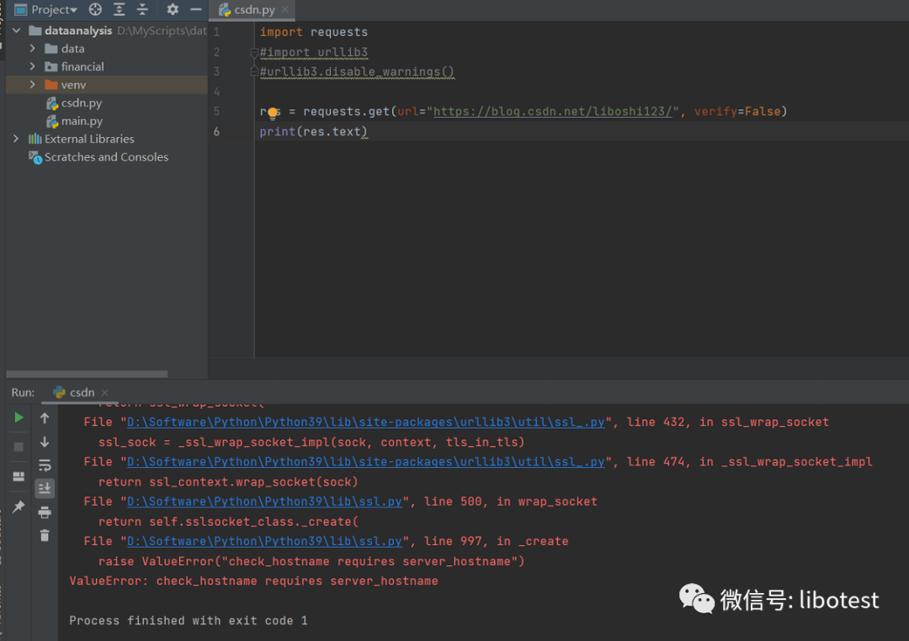

- [Python](#python)
  - [爬虫](#爬虫)
    - [requests库版本太高的error](#requests库版本太高的error)
      - [Python遇到的坑--ValueError: check\_hostname requires server\_hostname](#python遇到的坑--valueerror-check_hostname-requires-server_hostname)
# Python

## 爬虫

### requests库版本太高的error

#### Python遇到的坑--ValueError: check_hostname requires server_hostname

报错:

```python
import requests
res = requests.get(url="https://blog.csdn.net/liboshi123/", verify=False)
```

运行上面的代码的时候，发现报了下面的错误：

```python
  raise ValueError("check_hostname requires server_hostname")
ValueError: check_hostname requires server_hostname
```



报错的原因：

这个其实跟选用的python版本的关系不大，主要原因是因为每次使用 pip install 命令下载插件的时候，下载的都是最新的版本，比如下载requests插件，它会自动的将依赖的urllib3这个插件也安装，然后依赖的插件版本太高，就导致了这个报错的问题。

所以说，一般遇到这种莫名其妙的问题的时候，可以先去看一下是不是插件的问题导致的，解决措施就是 将urllib3插件的版本降低就可以，当然，直接在安装requests插件的时候，选择用低版本也可以解决这个问题。比如用下面的命令指定版本进行安装：

```python
pip install requests==2.20
或者使用下面的命令降低版本：
pip install urllib3==1.25.8
```

这种类似的问题，在使用一些框架的时候经常会遇到，比如有的小伙伴在学习django，然后照着别人博客写的文章操作，最后报错，很有可能就是插件的版本导致的。

另外，在线安装插件时，如果插件下载过慢，或者报错的话，可以在插件的命令后面加上 -i 指定插件安装的源。

```python
pip install 插件名称  -i http://mirrors.aliyun.com/pypi/simple
```

有时候报插件找不到的话，就换一个源试试。

不想每次都指定源进行安装的话 ，那就在用户名下文件夹下建一个pip的文件夹，然后新建pip.ini的配置文件，写入下面的内容就行(具体的源可以自己选择)：{创建这个配置文件的存放位置有很多种方式都可以，感兴趣的可以自己去试试，比如pip所在目录下，或者%APPDATA%目录下去新建文件夹。}

```python
[global]
index-url = http://mirrors.aliyun.com/pypi/simple
[install]
trusted-host=mirrors.aliyun.com
```

另外，有些插件通过上面的在线方式就是容易出现报错的，可以尝试用离线安装的方式去安装插件，去网上下载whl格式的文件进行安装，比如，可以在下面的链接下下载：

whl格式插件：

https://www.lfd.uci.edu/~gohlke/pythonlibs/#lxml

pip install xxx.whl

官网下载插件：

https://pypi.org/

解压后，在目录执行：python setup.py install